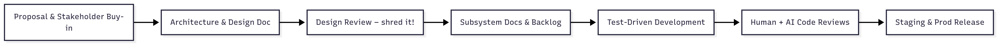
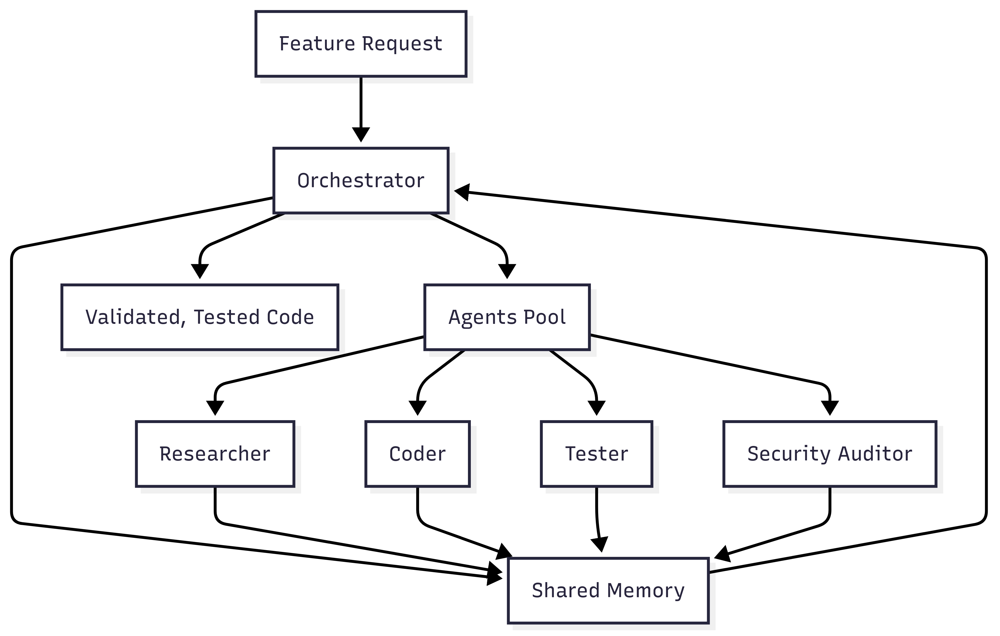

# *AI-Driven Software Development: Friend, Foe, or Rubber Duck?*

---

# Agenda
- About me
- Your experience
- Why this matters in 2025
- My experience: 80/10/10 workflow
- Modern AI-driven development pipeline
- Demo: TDD with Copilot & Claude
- Do’s & Don’ts 2025 edition
- Emerging frontier: Agentic engineering
- Future skills that stay valuable
- Q&A

---

# About me …

I’m Markus Friede Hens, Associate Partner at EY, with nearly 30 years in IT.  
I’ve worked across the full software lifecycle — from early system engineering and development, to enterprise architecture, cloud migration, and large-scale modernization.  

I’ve led and guided transformations in regulated industries and the public sector, translating complex compliance and business requirements into practical technical solutions.  

Today, my focus is helping organizations navigate digital transformation with clarity, resilience, and speed — drawing on hard-earned experience, not just buzzwords. 

---

# Why This Topic Matters – 2025

- AI coding agents have moved from novelty to **default toolchain**.
- Devs are **augmented**, not replaced.
- Velocity is easy—**reliability and governance** are the hard parts.
- The question isn’t *if* we use AI, but **how to use it without losing engineering discipline**.
- Constantly evolving - I redid this presentation three times ...

---

# My 80 / 10 / 10 Workflow

| Phase                                    | Focus                                                                                              | AI’s contribution                                                                          |
| ---------------------------------------- | -------------------------------------------------------------------------------------------------- | ------------------------------------------------------------------------------------------ |
| **80 % – Rapid baseline implementation** | Build a **complete first version** of the solution quickly, capturing architecture and core logic. | Generate initial scaffolding and repetitive code; accelerate boilerplate and integrations. |
| **10 % – Targeted validation**           | Identify the **critical logic paths** and write thorough automated tests before release.           | Draft unit- and integration-test skeletons; help design edge-case coverage.                |
| **10 % – Refine & harden**               | Refactor for readability, performance, and long-term maintainability; finalise documentation.      | Suggest refactors, produce documentation, support code review.                             |

⚠️ **Be critical:** AI will sometimes panic or hallucinate when domain knowledge is thin.

---

# Modern AI-Driven Dev Pipeline

* **Front-load the pain**: rigorous design and review before code
* **TDD first**: AI writes tests before features
* **Two-dev approval**: humans own the final merge

---

# Demo (10 min)

**Development with Copilot**

* your custom instructions/AGENTS.md/claude.md
* Peek at an AI-only codebase

---

# Do’s & Don’ts — 2025 Edition

| ✅ Do                                                   | ❌ Don’t                                    |
| ------------------------------------------------------ | ------------------------------------------ |
| Start with a solid **technical design doc**            | Jump straight into coding                  |
| Use AI to **generate tests first**                     | Rely on AI-generated code without tests    |
| Treat AI as a **pair programmer**                      | Expect it to own architectural decisions   |
| Give **tight, incremental prompts**                    | Dump multi-page specs and hope             |
| Review every pull request with **two human approvals** | Assume AI code is production-ready         |
| Track **metrics** (speed, defects, coverage)           | Talk about “productivity” without data     |
| Be explicit about **IP and data-leakage policies**     | Paste confidential code into public models |

---

# Bonus Lessons Learned (2025)

* Even with stronger models, **duplicate bugs** creep in when context is fragmented.  
* New models are better at reasoning, but **edge cases still need explicit prompting**.  
* Hallucinated APIs and “almost correct” logic remain a real risk when domain specificity is missing.  
* Large context windows help—but **cross-session state**, long chains of dependency, and legacy technical debt still break assumptions.  

> *Treat the model like an eager junior developer:  
> capable, fast—but always in need of oversight, depth in domain, and human review.*

---

# Claude-Code-Flow – A Vertical Take on AI Software Teams

### Why it stands out
Unlike general multi-agent frameworks (CrewAI, LangGraph, OpenAI Agents SDK),  
**Claude-Code-Flow** was built *specifically* to automate the **software-development lifecycle**.

---

### How it Works
- **Orchestrator** coordinates a small “AI dev team”:
  - **Researcher** – gathers requirements & explores libraries
  - **Coder** – writes and refactors code
  - **Tester** – designs and runs tests
  - **Security Auditor** – checks for vulnerabilities
- **Shared memory bank** (CRDT) keeps all agents in sync.
- **Recursive self-improvement** – the system iteratively enhanced itself.

---

---

### Lessons for AI-Driven Development

| Insight                                    | Why it matters                                             |
| ------------------------------------------ | ---------------------------------------------------------- |
| **End-to-end automation of the dev cycle** | Shows how AI can cover requirements → code → test → review |
| **Role-based agents mirror human teams**   | Makes it easier to map to existing SDLC practices          |
| **Shared memory prevents context loss**    | Critical for multi-step codebases                          |
| **Still a proof-of-concept**               | Valuable ideas, but not a production framework in 2025     |

---

> **Takeaway:**
> Claude-Code-Flow isn’t just “agents in general”—it’s a glimpse of an *AI software engineering team*, a vertical blueprint for how multi-agent systems can build and maintain code.

---

# What Actually Stays Valuable

* 🧠 Deep **business understanding**
* 🔧 **Systems thinking** & architecture
* ⚙️ **Resilience engineering** and **debugging**
* 🧪 **Test design** and coverage strategy
* 🔍 **Code review** & AI verification
* 🎯 **Prompt design** as a core engineering skill
* 🚦 **Ethical and regulatory oversight**

---

# Food for Thought

| Old World                    | AI-Driven World                   |
| ---------------------------- | --------------------------------- |
| Code as craft                | Code as raw material              |
| Syntax mastery               | System modelling mastery          |
| Framework expertise          | Problem decomposition expertise   |
| Boilerplate knowledge        | Context curation                  |
| Senior dev = language expert | Senior dev = systems orchestrator |

---

# Takeaway

> *The AI writes more code.
> The developer designs better systems.*

---

# Q\&A

* Real-world experiences?
* Surprises with AI pair programming?
* Fears? Optimism?

---

# Thank You

**Markus Friede Hens**
*No Word. No PowerPoint. Only Markdown, Mermaid, and Code.*

---