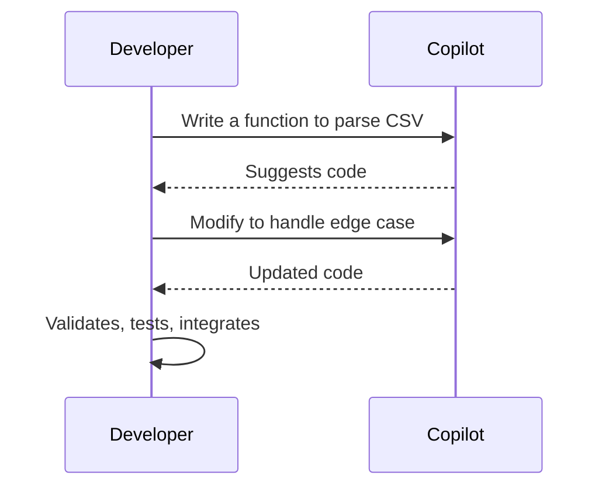
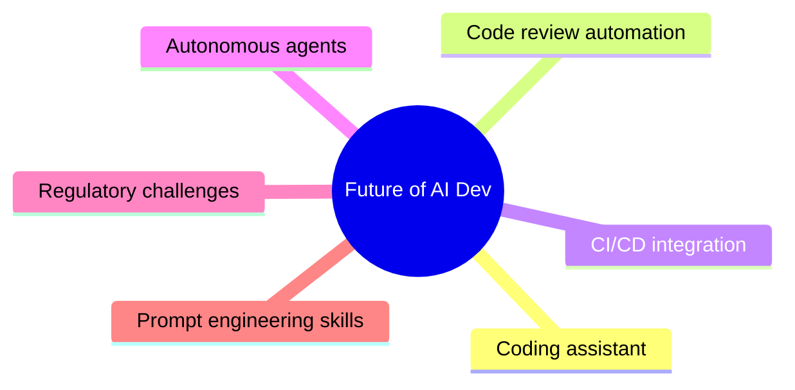
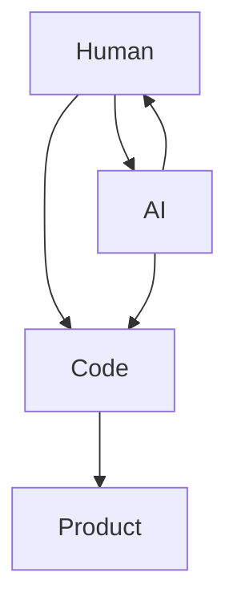
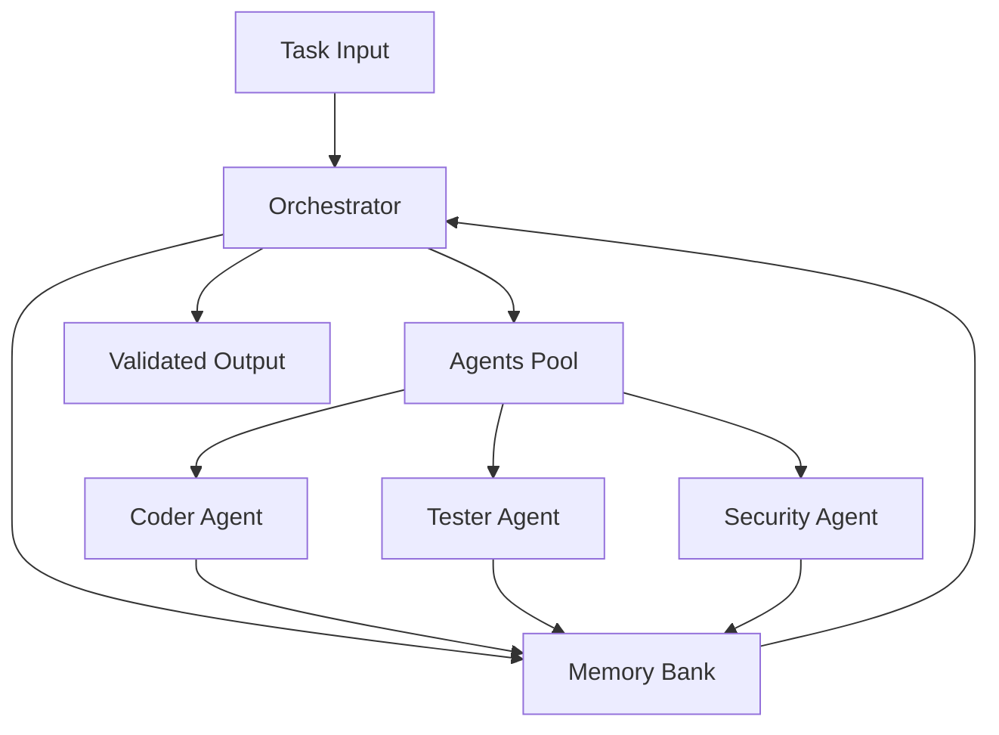

Excellent, Markus — this has the makings of a very strong and engaging talk. Let's scaffold your 1-hour session into a structured flow that works well for developers, includes a demo, stimulates reflection, and avoids the dreaded *“wall of slides”* problem.

---

# **Talk Title **

*"AI-Driven Software Development: Friend, Foe, or Rubber Duck?"*

---

# **Session Structure**

| Segment | Topic                                   | Duration |
| ------- | --------------------------------------- | -------- |
| 1       | Introduction & Framing                  | 5 min    |
| 2       | What is AI-Driven Development?          | 10 min   |
| 3       | Live Demo (Copilot in IntelliJ)         | 15 min   |
| 4       | The Dos and Don'ts                      | 10 min   |
| 5       | Food for Thought: Where Are We Heading? | 10 min   |
| 6       | Q\&A + Open Discussion                  | 10 min   |

---

# **Detailed Breakdown**

---

### 1️⃣ Introduction & Framing (5 min)

**Key Points:**

* Why this topic matters — it's not about *AI replacing developers*, but about *augmenting cognition*.
* AI is becoming part of the toolchain like compilers, linters, and version control.
* Developers here already use Copilot — today we explore *how to get better at it.*

**No slides. Use simple Markdown headings in your code editor or Obsidian-style presentation.**

---

### 2️⃣ What is AI-Driven Development? (10 min)

**Core Concepts:**

* Foundation models (LLMs) as fuzzy pair programmers.
* Strength: Pattern completion, boilerplate, simple algorithms, docstrings, tests.
* Weakness: Logical reasoning, architectural decisions, long-range dependencies.
* AI-driven software development != Auto-coding — it's interactive co-creation.
* Models hallucinate: high fluency, low factual grounding.

**Diagram:** Mermaid sequence diagram to show developer-AI interaction loop.

Example:



---

### 3️⃣ Live Demo: Copilot in IntelliJ (15 min)

**Goal:** Show both the power and the limitations.

**Demo ideas:**

* Implement a small REST API controller.
* Generate tests.
* Refactor some legacy-looking code.
* Ask it for architectural suggestions (and show where it gets it wrong).
* Use *"Explain this code"* feature.

**Key takeaway:**

> *AI provides velocity, not judgment.*

---

### 4️⃣ Dos and Don'ts (10 min)

| ✅ Do                                                                          | ❌ Don't                                                           |
| ----------------------------------------------------------------------------- | ----------------------------------------------------------------- |
| Use AI to **bootstrap boilerplate** code                                      | Expect it to get **architecture right**                           |
| Use **short, incremental prompts**                                            | Dump large multi-paragraph specs and expect coherent output       |
| Think like a **code reviewer**: Always verify AI output                       | Assume correctness — especially on edge cases, concurrency, state |
| Use AI to **refactor and explain unfamiliar code**                            | Trust its explanations without your own understanding             |
| Be very **explicit**: "Do X in Y style with Z library"                        | Leave instructions vague — LLMs hallucinate gaps                  |
| Use AI to write **parameterized tests** and mocks                             | Rely on AI-generated tests as your sole safety net                |
| Use **code context carefully**: provide files, function headers               | Assume AI can infer missing business rules                        |
| Leverage AI for **docstrings, comments, and documentation**                   | Let documentation drift by not validating technical accuracy      |
| Use AI as a **partner, not a servant**: interactive back-and-forth works best | Expect full solutions from single-shot prompts                    |

---

# **Bonus Insight **

* AI models sometimes **repeat bugs** you just fixed.
* They **prefer happy-path code** unless explicitly told otherwise.
* They may silently **invent APIs** that don't exist.
* Sometimes they confidently propose **logically invalid fixes**.
* They are prone to **state inconsistency** when large context windows are overloaded.

---

**Key Quote you might even project during the talk:**

> "Treat the model as an eager junior developer. Good at cranking out boilerplate. Bad at nuance. Always needs code review."
---

Here’s an enhanced version of the **Do’s and Don’ts** section, now featuring the real-world “agentic engineering” story from the *claude‑code‑flow* repository by ruvnet — perfect to illustrate how AI-driven orchestration works in practice.

---

## ✅ Do & ❌ Don’t (Enhanced)

| ✅ Do                                                                                                                                                    | ❌ Don't                                                      |
| ------------------------------------------------------------------------------------------------------------------------------------------------------- | ------------------------------------------------------------ |
| Use **multi-stage prompts** — break down tasks into clear, atomic steps                                                                                 | Assume one-shot prompts will yield correct results           |
| Treat the model as a **partner of partners** — e.g., use **Claude‑Flow** to spawn and coordinate multiple specialized agents                            | Expect a single AI tool to handle everything flawlessly      |
| Empower agents with specific roles: coder, tester, researcher, security auditor                                                                         | Leave agent roles undefined and hope for the best            |
| Use **shared memory** across agents — Claude‑Flow’s memory bank ensures context and consistency ([github.com][1], [reddit.com][2], [codenotary.com][3]) | Ignore persistence—each prompt loses context and coherence   |
| Build by leveraging **recursive development**: let agents help build their own orchestrator                                                             | Treat the system as static — no continuous improvement loop  |
| Scale to parallel tasks: let a swarm of agents handle complex workflows simultaneously                                                                  | Funnel everything sequentially — underutilizing AI potential |
| Monitor each agent’s progress via dashboards or terminal UIs, inspect logs                                                                              | Stay dark — no visibility means no control                   |
| Be clear about **failure policies**, rollbacks, agent retry logic                                                                                       | Trust agents implicitly — no undo or safe guardrails         |
| Combine advanced agent orchestration (Claude‑Flow) with interactive prompt-based tools (Copilot, Cursor) for complementary strengths                    | Use only one toolchain — risk redundancy or gaps             |

---

### 🧠 The *claude‑code‑flow* Story: Agentic Engineering in Action

* **Multi-agent orchestration**: ruvnet’s repository demonstrates running dozens of Claude-powered agents in parallel (researcher, coder, tester, security‑auditor) — all coordinated via a shared memory bank and orchestrator ([github.com][1]).
* **Recursive development**: As noted on Reddit, the author built *claude‑flow* itself using the same system — effectively a self-improving, modular engineering swarm ([reddit.com][2]).
* **Cost-effective scaling**: One developer comments you can run “a full AI R\&D team...for what you'd pay a junior dev for a few hours” ([reddit.com][2]).
* **Shared memory & monitoring**: With a CRDT-backed memory bank, agents coordinate knowledge and maintain coherence across tasks ([github.com][1]).

---

### 🎤 How to Use This Story in Your Talk

**Live narrative path:**

1. **Introduce**: “This isn't just hypothetical—look at *claude‑code‑flow*, where hundreds of agents collaborate on real code.”
2. **Explain the setup**: Describe the roles, shared memory, recursive development loop, and parallelism.
3. **Pull out lessons**:

   * Task orchestration > one-shot coding
   * Context sharing prevents duplication and inconsistencies
   * Monitoring + failure control = production readiness
4. **Contrast**: “Compare that to using a single Copilot window where context is lost per prompt.”
5. **Reinforce Do’s**: Highlight multi-stage prompts, memory, monitoring.
6. **Warn Don’ts**: Avoid unmanaged scaling, missing rollback logic, ignoring logs.

---

Together with Diwank’s field-notes, this story makes your **Do’s and Don’ts** both concrete and actionable — rooted in community practice and real code.

---

**Next steps?**

[1]: https://github.com/ruvnet/claude-code-flow?utm_source=chatgpt.com "ruvnet/claude-code-flow: This mode serves as a code-first orchestration ..."
[2]: https://www.reddit.com/r/ClaudeAI/comments/1l87dj7/claudeflow_multiagent_orchestration_platform_for/?utm_source=chatgpt.com "Multi-Agent Orchestration Platform for Claude-Code (npx claude-flow)"
[3]: https://codenotary.com/blog/using-claude-code-and-aider-to-refactor-large-projects-enhancing-maintainability-and-scalability?utm_source=chatgpt.com "Using Claude Code and Aider to Refactor Large Projects - Codenotary"


### 5️⃣ Food for Thought: The Future (10 min)

Stimulate thinking:

* How will AI change your role?
* From coding → to *code curation*, *system design*, *problem framing*.
* Emergence of agentic programming (AutoGPT-style).
* Regulatory, ethical, and IP implications.
* Future developer interviews may include “prompt design” and “AI tool usage”.

**Optional visual:**
A simple Mermaid mind map:



---

### 6️⃣ Q\&A and Open Floor (10 min)

Invite debate:

* “Who feels AI improves their coding productivity?”
* “Who has seen it generate dangerous code?”
* "What surprises you most?"

---

Excellent — here’s a **complete Markdown scaffold** for your 1-hour *AI-Driven Software Development* talk, fully incorporating:

* ✅ Your initial vision
* ✅ The Diwank *Field Notes*
* ✅ The *claude-code-flow* story
* ✅ Live demo slots
* ✅ Future perspective

The structure is designed for:

* Markdown rendering (e.g. Marp, Obsidian, HackMD)
* Developer audience
* Minimal slides, high engagement

---

# AI-Driven Software Development
### Friend, Foe — or Rubber Duck?

Markus Friede Hens
EY

---

# Agenda

- Framing: Why this matters
- What is AI-Driven Development?
- Demo: Copilot in VS Code
- Do’s & Don’ts (Field Notes)
- Agentic Engineering (Claude Code Flow)
- The Future
- Q&A

---

# Why This Topic?

- AI is now embedded in our developer workflows.
- Developers ≠ replaced, but **augmented**.
- We gain velocity — but must still apply judgment.
- How do we become *good* at AI-driven development?

---

# The Core Shift



* Co-creation, not automation.
* Fast scaffolding — slow reasoning.
* Prompting is a **new coding skill**.

---

# Demo Time 🔧

### Copilot + VS Code

* Scaffold REST API
* Generate parameterized tests
* Refactor legacy code
* Prompt explanations
* Observe limitations

> *“Velocity, not correctness.”*

---

# Real-World Field Notes


# DO ✅

* Bootstrap boilerplate
* Short, incremental prompts
* Act like a code reviewer
* Be explicit in instructions
* Use for refactoring & documentation
* Generate parameterized tests
* Leverage context windows smartly
* Use explainers on unknown code

---

# DON'T ❌

* Trust correctness blindly
* Prompt long specs at once
* Skip code review
* Assume proper architecture
* Ignore edge cases
* Accept hallucinated APIs
* Use AI-generated tests as sole coverage

---

# AI Failure Modes ⚠

* Repeats bugs you just fixed
* Hallucinates APIs
* Over-confident invalid logic
* Happy-path bias
* State inconsistency

---

# Claude-Code-Flow 🧠

### Agentic Engineering in Action

* Multiple Claude agents:

  * Researcher
  * Coder
  * Tester
  * Security Auditor
* Shared memory (CRDT-based)
* Recursive self-improvement
* Parallel task orchestration

---

# Claude Flow Architecture



---

# Key Lessons from Agentic Engineering

✅ Do:

* Break tasks into agent roles
* Use shared memory for context
* Monitor agents' progress
* Handle failures gracefully

❌ Don’t:

* Rely on one-shot prompts
* Skip monitoring
* Let agents drift without oversight

---

# Where Are We Going?

* Code generation → **Code orchestration**
* Developers as **AI team leads**
* New skills:

  * Prompt design
  * System curation
  * Agent management
* Ethical, regulatory & IP frontiers ahead

---

# Food for Thought

> Will future developers write code —
> or will they orchestrate teams of agents?

| Old World                     | AI-Driven World                   |
| ----------------------------- | --------------------------------- |
| Code as craft                 | Code as raw material              |
| Syntax mastery                | System modeling mastery           |
| Framework expertise           | Problem decomposition expertise   |
| Boilerplate knowledge         | Context curation                  |
| Senior dev =  language expert | Senior dev = systems orchestrator |

---

# What Actually Becomes Valuable

- 🧠 **Deep business understanding**
- 🔧 **Systems thinking and architecture**
- ⚙️ **Resilience engineering**
- 🧪 **Test design and coverage analysis**
- 🔍 **Code review & AI verification**
- 🎯 **Prompt engineering and instruction clarity**
- 🚦 **Ethical, regulatory, and safety oversight**

---

# Takeaway

> "The AI writes more code.  
> The developer designs better systems."

---

# Q\&A

* Real-world experiences?
* Surprises with Copilot?
* Fears? Optimism?
* Let's discuss!

---

# Thank You

**Markus / \[Your Contact Info]**

*No Word. No PowerPoint. Only Markdown, Mermaid, and Code.*

---

```

---

# ✅ Summary of What You Have Now:

- Modular
- Fully extensible
- Live-demo friendly
- Low-slide-fatigue
- Technically solid
- Provocative enough to keep 200 developers engaged

---

**Next Optional Add-Ons:**

1. **Demo Script** for your live Copilot demo.
2. **Prompt Engineering Cheat Sheet** you can share as handout.
3. **Speaker Notes version** to guide your flow.

👉 If you want, we can build these next to fully weaponize your delivery. Shall we?
```


